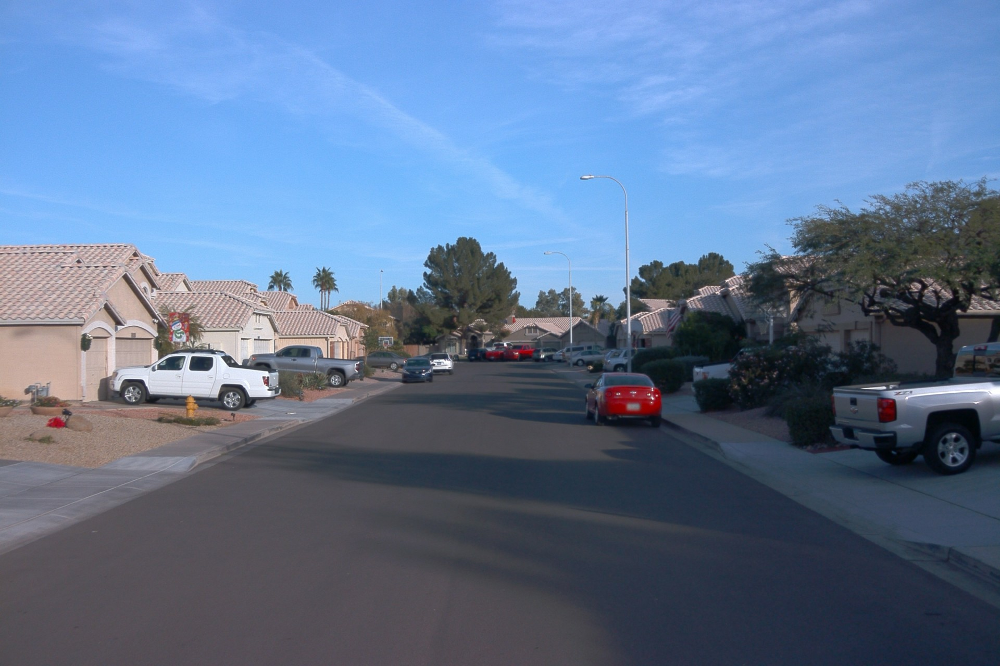
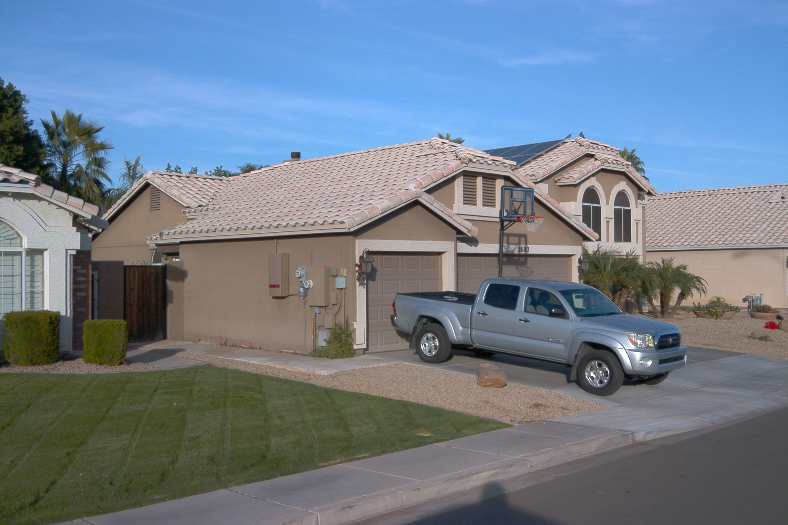
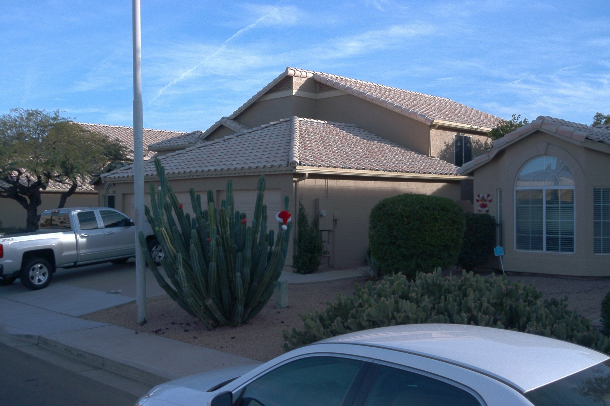
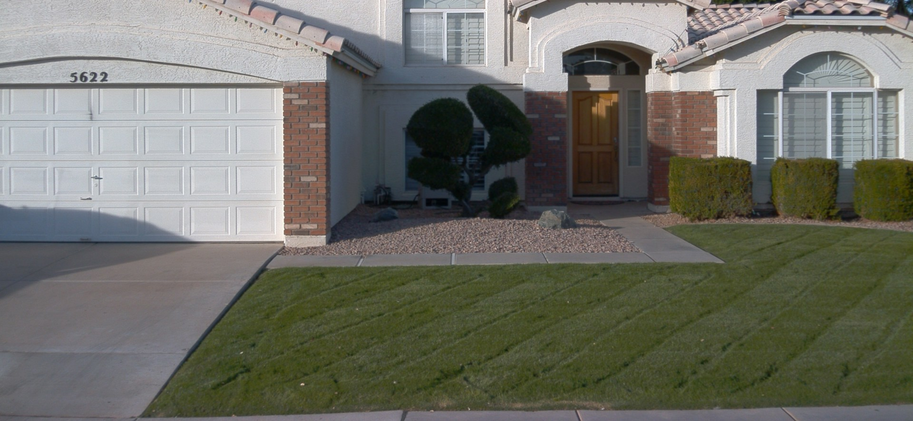
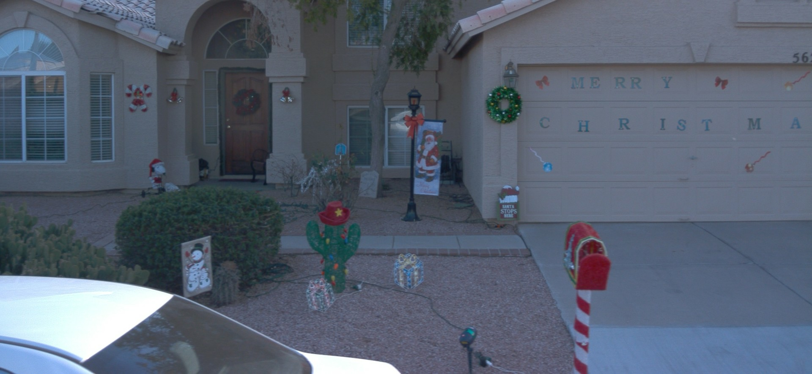
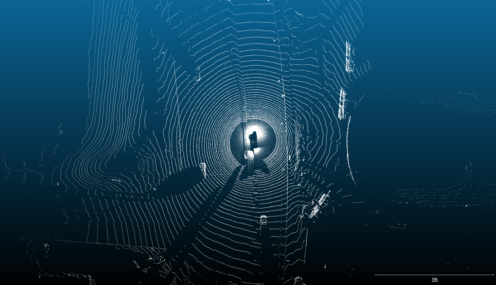
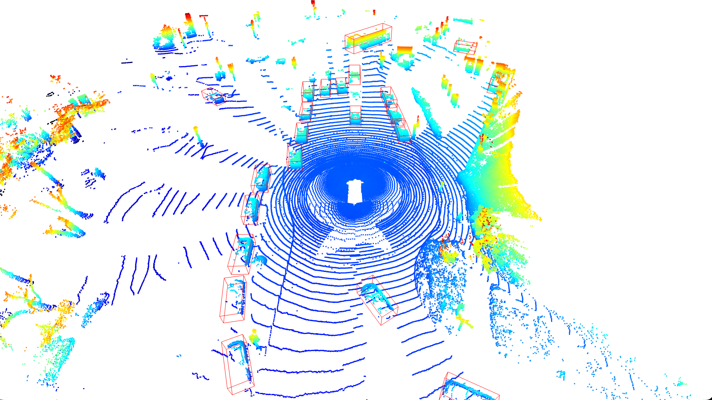
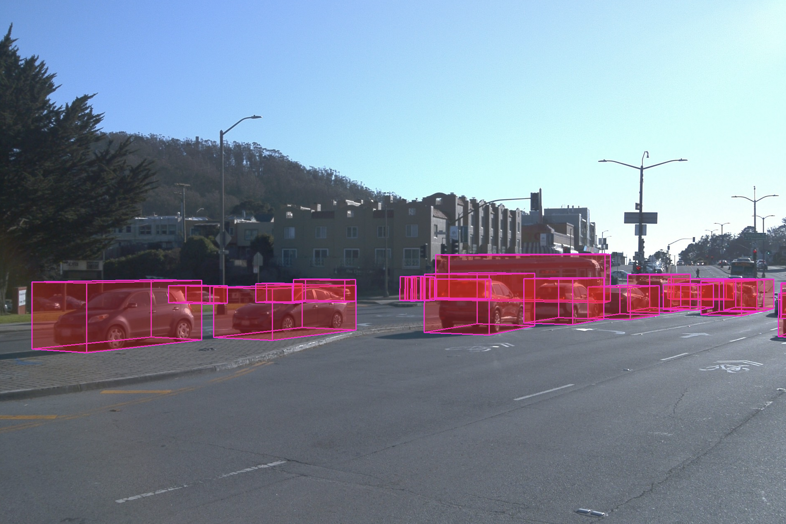
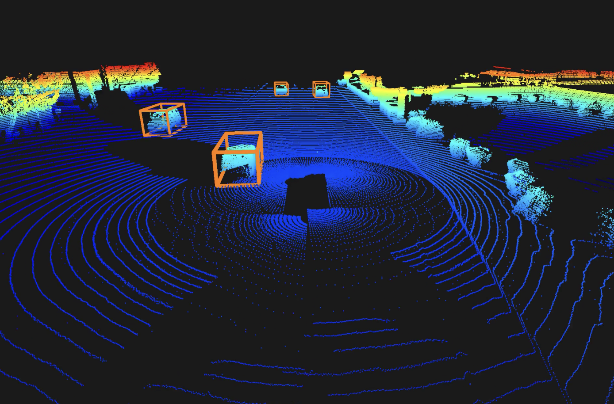
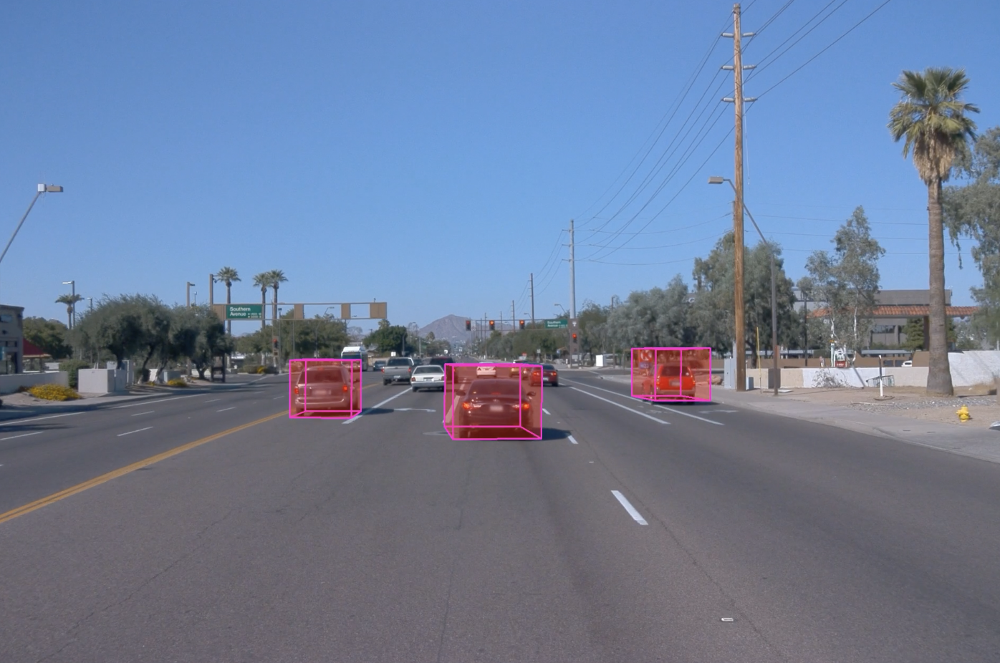

# LiDAR-based vehicles detection with Waymo Open Dataset

<p style="text-align:center">
<em>Oriented bounding boxes detection</em></br>

</p>

In this project, we are working with the [Waymo Open Dataset](https://waymo.com/open/download/) that provides hours of recording of LiDAR and camera sensors embedded on a vehicle. It comes with oriented bounding boxes that are well annotated in 3D. The goal is to detect surrounding vehicles based on the LiDAR data. Note that we don't rely on the 5 cameras for that, we only use them to reproject the 3D bounding boxes for visualization purpose.

Pedestrians, signs and cyclists could be detected in a similar way. LiDAR data enables to accurately detect the oriented bounding boxes up to 50m. The pointcloud is converted to a Bird Eye View image of 10cm pixel size and we feed the CNN with 3 channels : the maximum height, the minimum height and the number of points in these 10cm x 10cm vertical sections. The CNN is inspired from CenterNet where (x, y, z) positions + (width, height, length) dimensions and heading angle are regressed.

See the [YouTube video](https://www.youtube.com/watch?v=Xsg9VwqOAM4&ab_channel=antoinekeller)

## Dataset extraction

This network is trained on the [Waymo Open Dataset](https://waymo.com/open/download/).
I used the latest version (March 2024) of the [Perception Dataset](https://console.cloud.google.com/storage/browser/waymo_open_dataset_v_1_4_3)

In the individual files, you will find _.tfrecord_ segments splitted in training/validation/testing folders. I suggest to download them (manually or with _gsutil_) inside `tfrecords/training` and `tfrecords/validation`.

After downloading required python package (like `waymo-open-dataset-tf-2-12-0`), use this command to extract PLY, images, labels, and camera intrinsic/extrinsic poses.

```
python3 extract_tfrecord.py tfrecords/training/individual_files_training_segment_[...]_with_camera_labels.tfrecord dataset/training/
```

This will put your data inside `dataset/training`

Note that this worked (for me) on Ubuntu 22.04, not on MacOS.

This will write to `dataset/training/individual_files_training_segment_[...]_with_camera_labels`:

- `pointclouds`: containing LiDAR scans at each timestamp (PLY)
- `labels`: containing objects detected as oriented bounding boxes with classes
- `cameras.json`: intrinsic/extrinsic of the 5 cameras surrounding the vehicle
- `images`: containing images

To enable image extraction simultaneously, you can add `--front`, `--front-left`, `--front-right`, `--side-left` or `side-right` at the end of previous command.

<p style="text-align:center">
<em>Front camera</em></br>

</p>

|             Front-left             |           Front-right            |
| :--------------------------------: | :------------------------------: |
|  |  |

|             Side-left             |           Side-right            |
| :-------------------------------: | :-----------------------------: |
|  |  |

If you want to do it for many tfrecords (which is a good idea), you can use this basic script:

```
sh extract_tfrecords.sh
```

## Insights on the dataset

<p style="text-align:center">
<em>By day</em></br>

</p>

<p style="text-align:center">
<em>By night</em></br>

</p>

<p style="text-align:center">
<em>Under the rain</em></br>

</p>

There are usually ~200 frames per sample. It corresponds to ~30 seconds, meaning that we are running at ~6.7 fps.

The LiDAR scans are fused into one single pointcloud surrounding the vehicle. They contain >100k points and can see up to 70 meters around the car. The ground is at z = 0. The car is located at the origin (0, 0, 0). The forward direction is +X, +Y points to the left of the car, Z points upwards.

<p style="text-align:center">
<em>Fused point cloud</em></br>

</p>

## Visualize the labels

### Bouding boxes on PLY

To visualize the point clouds and display the bounding boxes of the vehicles:

```
python3 viz.py dataset/training/individual_files_training_segment-etc
```

Then, you can press _SPACE_ to pause/play the processing. In pause mode, you can go frame by frame by hitting the _N(ext)_ key.

I intentionnally only kept the vehicle bounding boxes, but you can also display the other classes (pedestrian, signs, cyclists). There is also a filtering on the number of points, this is crucial because we can't expect our CNN to detect every objects even when a very limited amount of points hit the vehicles.

<p style="text-align:center">
<em>Show bounding boxes with Open3D</em></br>

</p>

### Bouding boxes projected onto cameras

You can project the bounding boxes onto any camera you like.

```
python3 viz.py dataset/training/individual_files_training_segment-etc --front
```

<p style="text-align:center">
<em>Show bounding boxes projected on the front camera</em></br>

</p>

## CNN training

The network is inspired from CenterNet and uses Resnet as a backbone. The pointcoud is converted to a BEV image with a "pixel" of 10cm. The 3 channels are not RGB, but the maximum height, the minimum height and the number of points contained in the 10cm x 10cm vertical square.

Then we predict the center of the bounding box, its width, its length, its height and its orientation. We also predict the z position since we can not assume that the ground is flat.

Check the `training-and-inference.ipynb` notebook. After training, you will be able to extract the inference results on the validation dataset.

## CNN inference

At the end of the notebook, you can run the network on a complete sequence. This will write to `inference/` and store the results of each frame in `inference_***.json`, with the exact same format than labels json.

```
python3 viz.py dataset/validation/individual_files_validation_segment-etc --inference
```

<p style="text-align:center">
<em>CNN results with Open3D viz</em></br>

</p>

You can also visualize how the 3D bounding boxes are projected to the camera

```
python3 viz.py dataset/validation/individual_files_validation_segment-etc --inference --front
```

<p style="text-align:center">
<em>Bounding boxes projected to the front camera</em></br>

</p>
